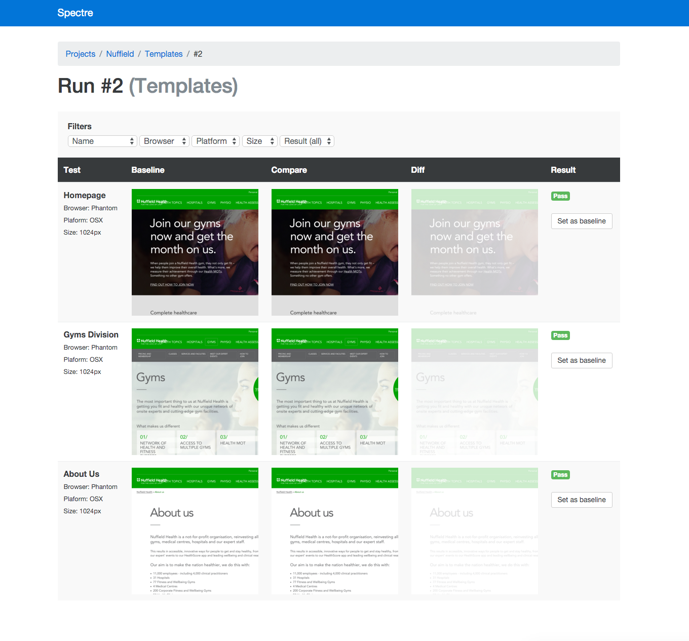

# Spectre

Spectre is a web application to diff screenshots. It's heavily influence by [VisualReview](https://github.com/xebia/VisualReview), [BackstopJS](https://github.com/garris/BackstopJS) and [Wraith](https://github.com/BBC-News/wraith).

## Requirements

* Postgres
* Imagemagick

## Setup

* Clone the repo
* `bundle exec rake db:create && bundle exec rake db:schema:load`
* `bundle exec rails s`
* Copy `.env.example` and rename to `.env`. Change the url details if you need to.

## Submitting tests

A "test" is a screenshot and associated metadata. A test is categorised under a Project, which in turn has (test) Suites. A test is submitted and associated with a "run" of a suite.

First you should create a new "run". The JSON response will contain the `run_id` to submit with each subsequent test.

    POST /runs
      project: My Projetc Name
      suite: My Suite Name

Then you can submit a screenshot!

    POST /tests
      test:
        run_id: {run_id from above},
        name: Homepage,
        platform: OSX,
        browser: PhantomJS,
        width: 1024,
        screenshot: <File>

* `name` is a friendly name of your test. It should describe the template, component or state of the thing you've screenshotted
* `platform` is the OS/platform that the screenshot was taken on (e.g. OSX, Windows, iOS, Android etc.)
* `browser` is the browser that was used to render the screenshot. This will usually be a headless webkit such as Phantom, but if using Selenium you may have used a "real" browser
* `width` is the screenshot size
* `screenshot` is the image itself. PNGs are preferred

## Dummy tests

An example test run can be executed using:

    bundle exec rake screenshots

## Administration

Spectre doesn't provide a UI or API to edit or delete content. We've included `rails_admin`, so head to `/admin` for this. By default there is no password.

## Tests

[Rspec](http://rspec.info/) and [Cucumber](https://cucumber.io) are included in the project.
Test coverage is minimal but please don't follow our lead, write tests for anything you add.
Use `rspec && rake cucumber` to run the existing tests.

## TODO

* upgrade to Rails 5 when released
* use ActionCable on Run::show view to update list as tests are submitted
* ability to set a limit for the number of test runs to keep (which means we can keep screenshots for passing tests too, cleaner UI)
* refactor baselines into their own model/table, one row per unique key (also store the test info here) so that tests can be blatted but the baseline screenshots and info remain
* it'd be useful for the "Update baseline" button to anchor to page scroll when reviewing many tall screenshots (otherwise you have to scroll back up to click)
* ability to set the diff highlight colour (e.g. if your sit is red, the default red will be useless). Set on a per-run or per-test basis? (Passed in the request, not stored as Spectre config)
